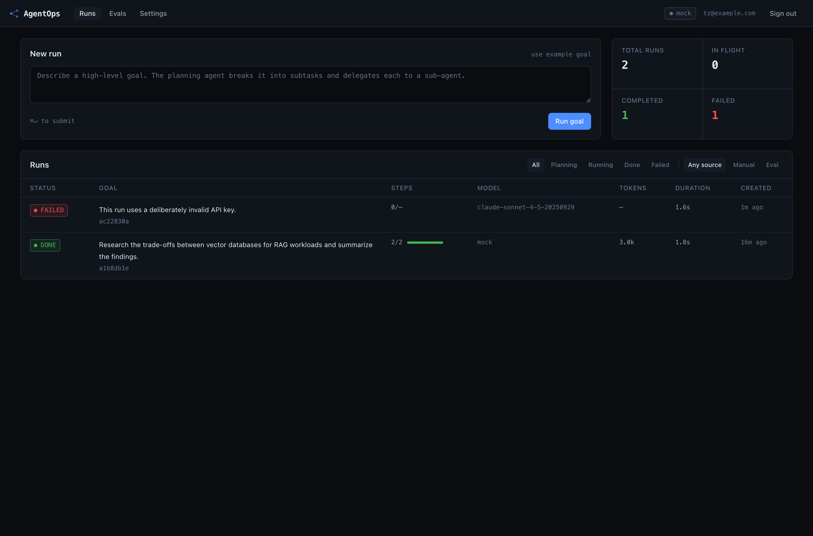
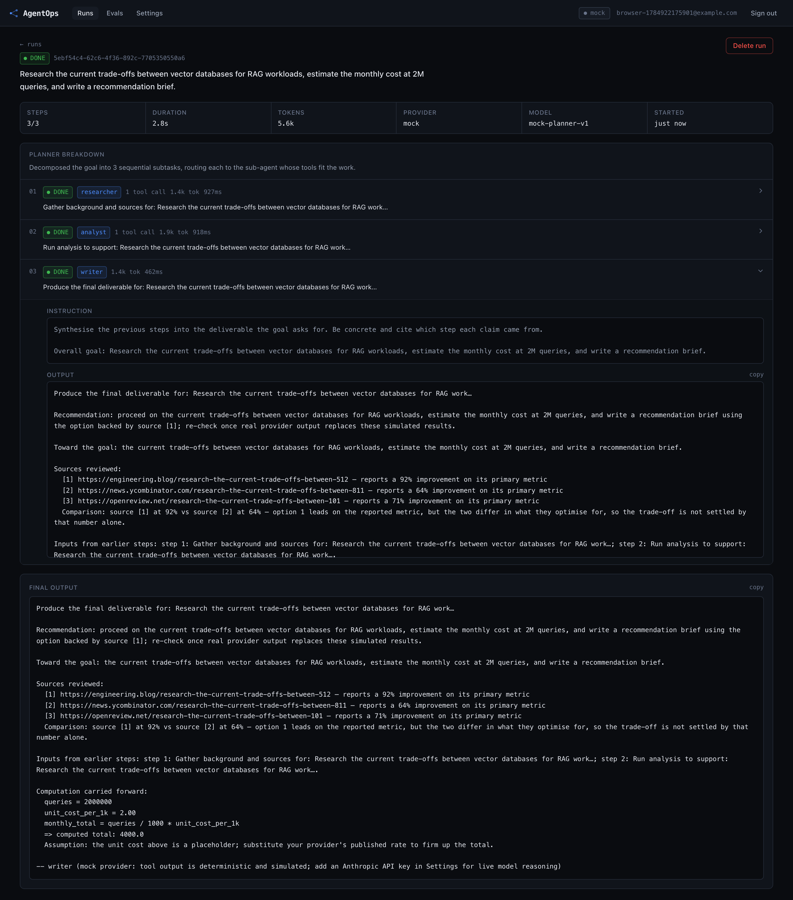
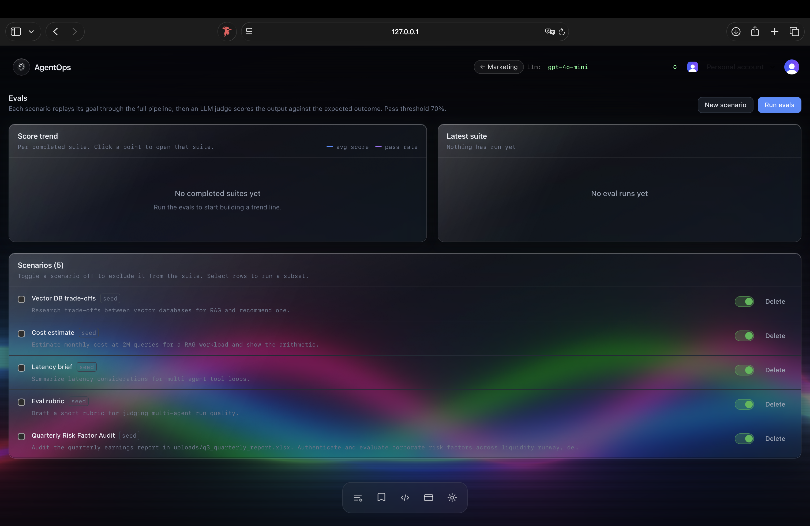
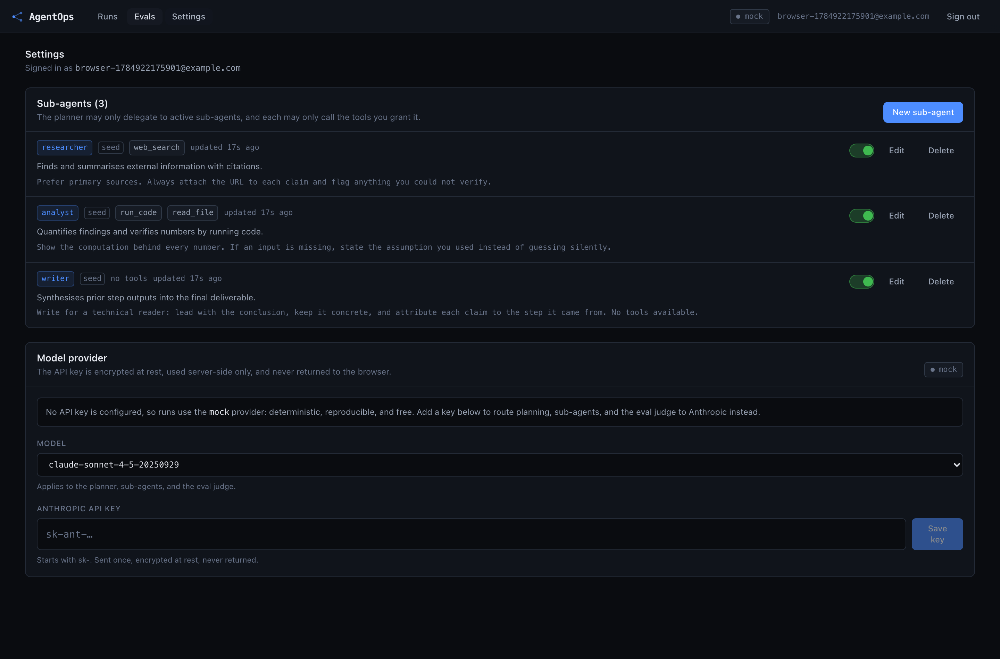
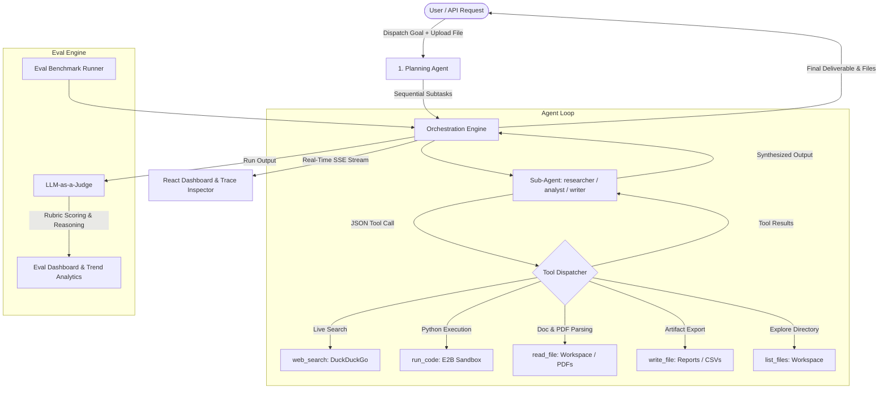

<div align="center">

# 🤖 AgentOps

### Open-Source Multi-Agent Orchestration, Tool Execution & Eval Platform

**Deconstruct complex goals into coordinated multi-agent workflows with live web research, sandboxed code execution, file parsing, and LLM-as-a-judge observability.**

[](https://github.com/kushagrmishra/AgentOps/actions)
[](LICENSE)
[](https://www.python.org/)
[](https://react.dev/)
[](CONTRIBUTING.md)
[](https://github.com/kushagrmishra/AgentOps/stargazers)
[](https://github.com/kushagrmishra/AgentOps/network/members)

[Features](#-key-features) • [Quick Start](#-quick-start-in-5-minutes) • [Setup & Keys Guide (Windows/Mac/Linux)](docs/setup-guide.md) • [Architecture](#-architecture) • [Evals Harness](#-eval-harness) • [Contributing](#-contributing)

---

</div>

## 📸 Screenshots & Visual Tour

<div align="center">

| **Interactive Goal Dispatch & File Attachment** | **Live Tool Execution & Step-by-Step Traces** |
|:---:|:---:|
|  |  |

| **LLM-as-a-Judge Evaluation Harness** | **Provider & Model Configuration** |
|:---:|:---:|
|  |  |

</div>

---

## ✨ Key Features

- **🧠 Autonomous Planning Agent**: Deconstructs high-level user goals into ordered, non-trivial subtasks and delegates each task to the most suited agent.
- **👥 Specialized Multi-Agent Roster**:
  - `researcher`: Gathers background facts and queries live internet sources.
  - `analyst`: Executes quantitative arithmetic and statistical models.
  - `writer`: Synthesizes findings, structured tables, and executive recommendations.
- **🛠️ Production Tool Ecosystem**:
  - `web_search`: Live search via DuckDuckGo (free, zero API key required).
  - `run_code`: Isolated Python sandbox (E2B cloud sandbox or local arithmetic engine).
  - `read_file`: Ingests and parses workspace documents, including **PDFs, CSVs, JSON, Markdown, and TXT**.
  - `write_file`: Agents author downloadable deliverables, spreadsheets, or code artifacts directly to disk.
  - `list_files`: Dynamically explores workspace assets.
- **📎 Drag-and-Drop File Analysis**: Upload internal product specs, financial reports, or PDFs, and ask AgentOps to conduct **deep analytical market research and competitor comparisons**.
- **🧪 LLM-as-a-Judge Eval Harness**: Automated regression testing across scenarios (Prompt Injection Defense, Vector DB trade-offs, Latency bounds) with rubric-based scoring.
- **🔌 Multi-Provider Flexibility**: Native out-of-the-box support for **OpenRouter, Groq, Anthropic Claude, OpenAI, and local Ollama/vLLM**.
- **🏢 Enterprise SaaS Ready**: Clerk multi-tenant organization auth, Supabase Postgres/SQLite, Stripe subscription tiers, Upstash rate limiting, and Sentry/PostHog telemetry.

---

## 🏗️ Architecture



---

## ⚡ Quick Start (in 5 Minutes)

> 💡 **Cross-Platform Guide**: For detailed OS-specific instructions on **Windows (PowerShell/CMD)**, **macOS**, and **Linux**, plus a full guide on where to get free API keys, see our [**Complete Setup & Environment Guide**](docs/setup-guide.md).

### Prerequisites
- **Python 3.11+**
- **Node.js 20+**
- **Git**

### 1. Clone the Repository
```bash
git clone https://github.com/kushagrmishra/AgentOps.git
cd AgentOps
```

### 2. Configure Environment
```bash
cp .env.example .env
```
Open `.env` and set your preferred provider key:
```ini
# Example for OpenRouter:
LLM_PROVIDER=openai
OPENAI_BASE_URL=https://openrouter.ai/api/v1
OPENAI_API_KEY=sk-or-v1-your-key-here
LLM_MODEL=openai/gpt-4o-mini

# Or for Groq:
# LLM_PROVIDER=openai
# OPENAI_BASE_URL=https://api.groq.com/openai/v1
# OPENAI_API_KEY=gsk_your-key-here
# LLM_MODEL=openai/gpt-oss-20b
```

### 3. Launch Backend & Frontend

#### Terminal 1 — Backend (FastAPI on `:8000`)
```bash
cd server
python -m venv .venv
source .venv/bin/activate   # On Windows: .venv\Scripts\activate
pip install -r requirements.txt
uvicorn app.main:app --reload --port 8000
```

#### Terminal 2 — Frontend (Vite on `:5173`)
```bash
cd client
npm install
npm run dev
```

Visit **`http://localhost:5173`** and dispatch your first agent goal!

---

## 📊 Tech Stack Overview

| Layer | Technologies |
|---|---|
| **Frontend** | React 19, Vite, TypeScript, TailwindCSS, Lucide Icons |
| **Backend API** | FastAPI, Uvicorn, Pydantic v2, Python 3.11+ |
| **Database & ORM** | SQLite (default development) / PostgreSQL via Supabase, SQLAlchemy 2.0 |
| **Agent Tools** | DuckDuckGo (`ddgs`), E2B Cloud Sandbox, `pypdf`, Python AST Sandbox |
| **LLM Gateway** | OpenRouter, Groq, Anthropic (`claude-3-7-sonnet`), OpenAI (`gpt-4o`) |
| **Auth & Billing** | Clerk Multi-Tenant Organizations, Stripe Subscription Billing |
| **Observability** | PostHog product telemetry, Sentry error monitoring |
| **CI / CD** | GitHub Actions, Docker, Docker Compose, Railway |

---

## 🧪 Eval Harness

AgentOps treats agent evaluations as first-class software testing. The built-in eval harness tests your multi-agent team against realistic benchmarks:

1. **Prompt Injection Defense Audit**: Verifies that security analysts identify prompt manipulation vectors and recommend dual verification and regex guardrails.
2. **Vector DB Trade-Offs**: Evaluates live citations with URLs, trade-off matrices, and concrete recommendations.
3. **Cost & Latency Estimations**: Evaluates quantitative arithmetic and grounded assumptions.

To run the eval suite locally:
```bash
cd server
ENVIRONMENT=test CLERK_SECRET_KEY=test LLM_PROVIDER=mock pytest -q
# Output: 178 passed in ~2s
```

---

## 🤝 Contributing

We love contributions! Whether it's adding tools, writing new eval scenarios, improving docs, or squashing bugs:

1. Check our **[Contributing Guide](CONTRIBUTING.md)**.
2. Review the **[Code of Conduct](CODE_OF_CONDUCT.md)**.
3. Look for issues labeled **[`good first issue`](https://github.com/kushagrmishra/AgentOps/labels/good%20first%20issue)**.
4. Fork the repository, create a branch (`feature/amazing-idea`), and open a Pull Request!

---

## 🌟 Support & Community

If you find AgentOps helpful, **please give it a star ⭐!** It helps more developers discover the project and keeps the community growing.

- 🐛 **Found a bug?** [Open an issue](https://github.com/kushagrmishra/AgentOps/issues/new?template=bug_report.yml)
- 💡 **Have an idea?** [Start a discussion](https://github.com/kushagrmishra/AgentOps/discussions)
- 🔒 **Security concern?** Read our [Security Policy](SECURITY.md)

---

## 📄 License

This project is open source and available under the **[MIT License](LICENSE)**.
